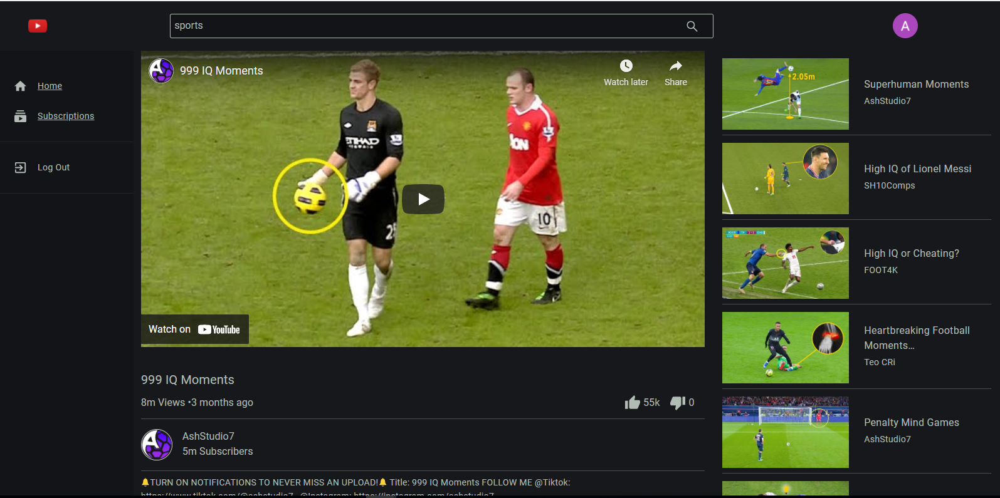

# YoutTube Clone

## Tech Stack Used -

- FrontEnd: ReactJs
- Redux for application state management
- Styling: SASS (preprocessor scripting language that is compiled into CSS.)
- Google O authentication with firebase
- Youtube API V3 for endpoint requests.

  

### Deployment on firebase.

### Functionalities -

#### User Authentication:

- Google OAuth firebase

#### Youtube API V3

- Youtube home screen where most viewed & popular videos from IN region are beign fetched.

- Watchscreen for playing the actual video.

- Related videos fetched besides the actual play vid.
- Channel Subscriptions page of the user.
- POST comment on the video by actual google user id.
- 
- Channel Page & videos of that respective channel fetched on that page.

### Lazy loading & skeleton screen

- Lazy loading is a way to dramatically decreasing initial loading time to clients.
- Loading only the first 12 cards from the array list & when user scrolls, the other cards load then.
- Also till the image is loaded completely till that time we show skeleton custom component for better user experience & less initial time which actually increases the web performance of web app when scaled.

